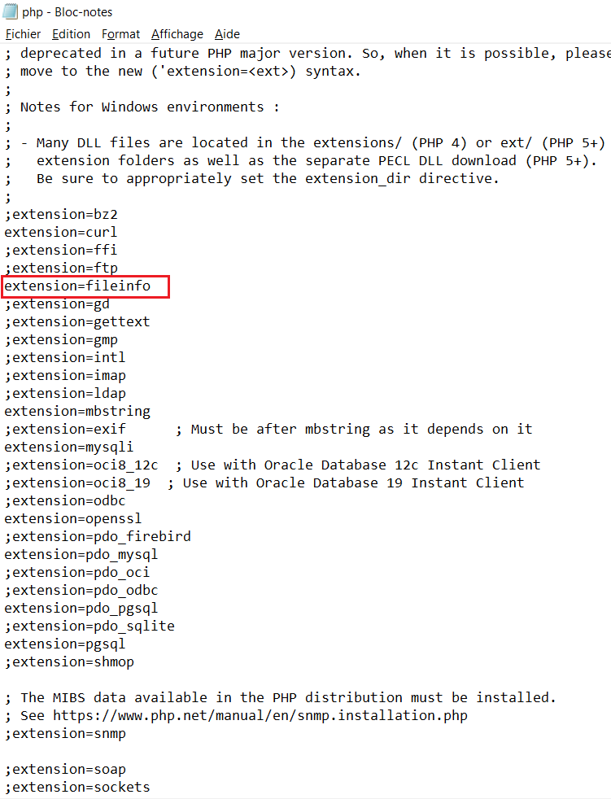

## BARBOFUS

Projet Git pour le site de BARBE\_\_\_DOUCE

## TECHNO

Tall Stack:

-   Tailwind CSS
-   AlpinJS
-   Laravel
-   Livewire

## INSTALLATION

Pour installer le projet, commencez par le cloner, pensez aussi à créer une Database nommé 'barbofus' avec le logiciel de votre choix, ensuite executez les commandes suivantes dans une console \:

```
composer install
npm install
php artisan storage:link
cp .env.example .env
php artisan key:generate
php artisan migrate --seed
npm run dev
```

Si vous n'utilisez pas Laragon ou un autre soft dans le genre, tapez la commande 'php artisan serve' pour ouvrir le site dans le localhost:8000.

N'oubliez pas de modifier votre fichier .env pour y mettre votre connexion Database.

A chaque pull depuis le git, pensez à utiliser les INSERT bdd qui sont dans storage/app/bdd/barbofus.sql.
## PHP

lien vers php : https://www.php.net/manual/fr/intro-whatis.php

Lorsque vous installez php veuillez à ne pas oublier de l'ajouter dans vos variables d'environnements

- Version PHP 8.0 minimum

et pensez à activer les extension nécessaires au lancement (voir si-dessous)

```
extension=fileinfo
```

pour simplifiez votre recherche vous pouvez utilisez la touche ```f3``` et indiquez dans la barre de recherche ```;extension```


